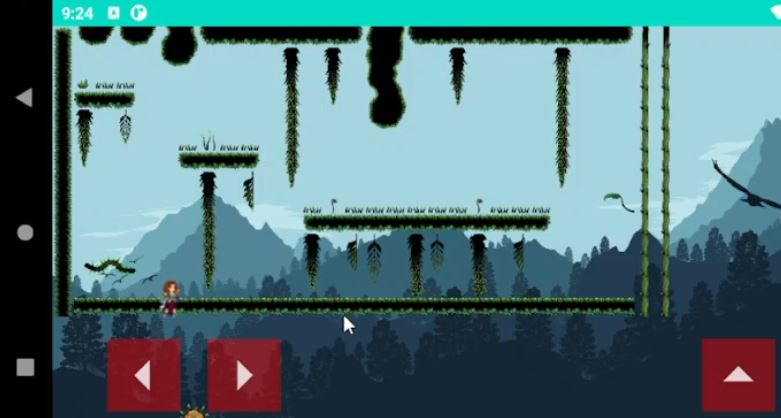

# Speed Jumper

## Description

Ce projet est un jeu de plateforme sur Android dont le but est de se déplacer dans un environnement afin d'atteindre l'arrivée de chaque niveau. Ce projet a été réalisé dans le cadre de la deuxième année de DUT informatique.  
Les cartes de ce jeu sont élégantes et sont générées avec un système de Tile-Mapping depuis le logiciel Tiled, et sont ensuite chargées directement dans le jeu. Vous pouvez ajouter les vôtres sans devoir modifier le code ! Chaque carte peut être composée de plusieurs *tilesets* différents, et vous pouvez créer des cartes de la taille que vous souhaitez.

  
*Capture d'écran du jeu sur un Xiaomi Redmi Note 10 Pro.*

## Lancement

Tout d'abord, il faut commencer par cloner ce projet (https://gitlab.iut-clermont.uca.fr/jetremblay/speed-jumper.git).  
La branche principale est `master`.  
Ouvrir le projet depuis Android Studio. Vous pouvez compiler et vous amuser (et l'installer sur votre téléhone) ! 😄

# Elements importants dans le code
* Respect des principes SOLID.
* Une responsabilité par classe.
* Un gros travail de conception (patrons, cohérence...).
* Création d'une boucle de jeu threadée observable.
* Moteur de jeu complet (chargement des cartes créées depuis Tiled, affichage, création de nos propres collisions, déplacements...).
* Travail pour adaptation de ce jeu sur Android (poids en mémoire des images, création de nos propres `View`s plutôt que l'utilisation de `SurfaceView`, fragments, `Toast`s, déplacement entre les fenêtres, `RecyclerView`...)

> Voir la documentation (fichier `preuves.pdf`) pour plus d'informations.

## Language utilisé
* Java

## Auteurs

Jeremy Tremblay  
Guillaume Toumazet
